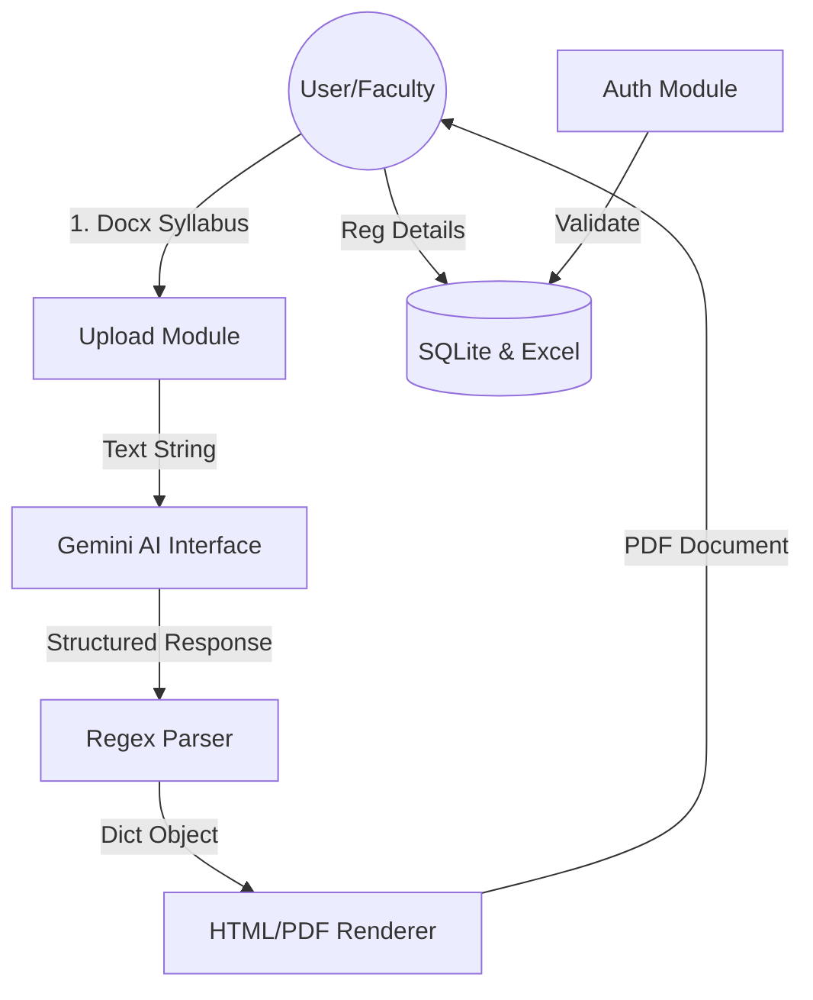
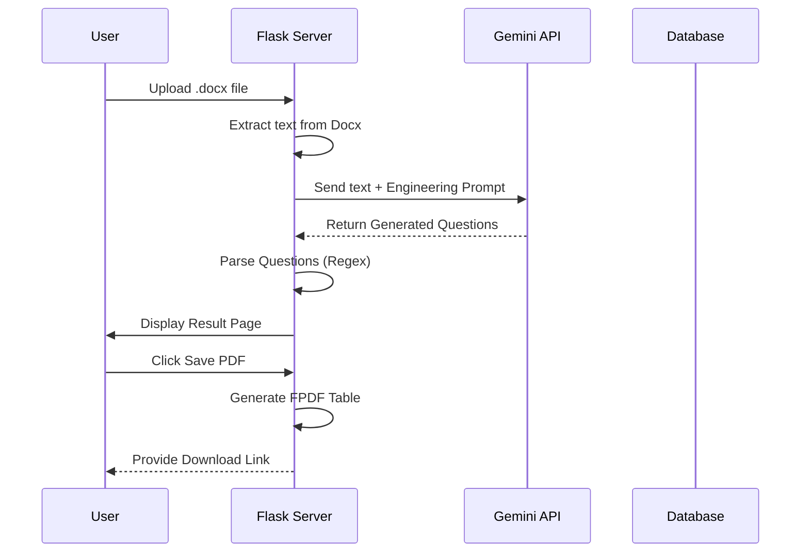
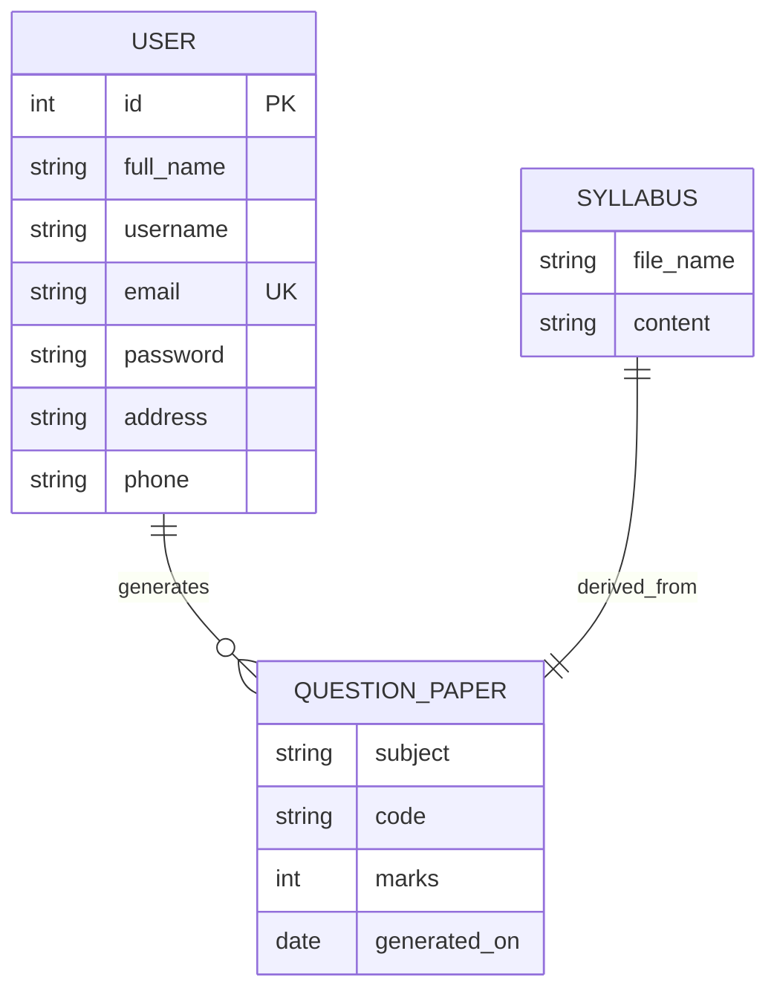

# PROJECT REPORT ON
# AI-POWERED AUTOMATED QUESTION PAPER GENERATOR

**Institution:** VET Institute of Arts and Science
**Project Type:** Web-based AI Application
**Technologies:** Python, Flask, Google Gemini AI, SQLite, FPDF

---

## ABSTRACT

The educational sector is undergoing a massive digital transformation, with Artificial Intelligence (AI) playing a pivotal role in streamlining administrative and academic tasks. One of the most time-consuming tasks for educators is the creation of high-quality, balanced question papers that adhere to specific syllabus constraints and cognitive levels. This project, "AI-Powered Automated Question Paper Generator," addresses this challenge by leveraging Large Language Models (LLMs) to automate the generation process. Built using the Flask web framework and powered by Google’s Gemini API, the system allows educators to upload course content documents in Word format, which the AI then analyzes to produce structured, unit-wise question papers. These papers are formatted according to institutional standards and can be exported as PDF files. The system also includes a secure user authentication module with data persistence in SQLite and Excel, ensuring a robust and user-friendly experience for academic staff.

---

## TABLE OF CONTENTS

1.  **CHAPTER 1: INTRODUCTION**
    *   1.1 Background
    *   1.2 Problem Statement
    *   1.3 Objectives
    *   1.4 Scope of the Project
2.  **CHAPTER 2: LITERATURE SURVEY**
    *   2.1 Evolution of AI in Education
    *   2.2 Role of Generative AI and LLMs
    *   2.3 Analysis of Existing Question Generation Systems
3.  **CHAPTER 3: SYSTEM ANALYSIS**
    *   3.1 Existing System
    *   3.2 Proposed System
    *   3.3 Feasibility Study
        *   3.3.1 Technical Feasibility
        *   3.3.2 Operational Feasibility
        *   3.3.3 Economic Feasibility
4.  **CHAPTER 4: REQUIREMENT SPECIFICATION**
    *   4.1 Functional Requirements
    *   4.2 Non-Functional Requirements
    *   4.3 Hardware Requirements
    *   4.4 Software Requirements
5.  **CHAPTER 5: SYSTEM DESIGN**
    *   5.1 System Architecture
    *   5.2 Database Design
    *   5.3 UML Diagrams (Data Flow, ER)
    *   5.4 UI/UX Design Philosophy
6.  **CHAPTER 6: IMPLEMENTATION**
    *   6.1 Environment Setup
    *   6.2 Technical Modules
        *   6.2.1 Authentication Module
        *   6.2.2 AI Processing Module
        *   6.2.3 PDF Generation Module
    *   6.3 Prompt Engineering Techniques
7.  **CHAPTER 7: TESTING AND RESULTS**
    *   7.1 Testing Methodologies
    *   7.2 Unit Testing
    *   7.3 Integration Testing
    *   7.4 Evaluation of AI-Generated Content
8.  **CHAPTER 8: CONCLUSION AND FUTURE ENHANCEMENTS**
    *   8.1 Conclusion
    *   8.2 Future Enhancements
9.  **REFERENCES**

---

## CHAPTER 1: INTRODUCTION

### 1.1 Background
In the contemporary academic landscape, the quality of assessment is a fundamental pillar of education. Assessment tools, particularly question papers, serve as the primary means to evaluate a student's understanding, critical thinking, and application of knowledge. Traditionally, the process of setting a question paper is manual, involving hours of reviewing syllabi, selecting topics, ensuring appropriate difficulty levels, and formatting the document. For faculty members handling multiple courses, this process is not only tedious but also prone to human error—such as repetitive questions, disproportionate weightage to certain topics, or formatting inconsistencies.

#### 1.1.1 The Digital Shift in Academia
The last decade has seen a significant shift towards "Smart Campus" initiatives. Universities are increasingly adopting automated tools for attendance, grading, and course delivery. However, the intellectual task of "Paper Setting" has remained largely artisanal. This is primarily because it requires a high level of "Content Awareness"—the ability to know which topics are important and how they should be queried. With the advent of Large Language Models (LLMs), we now have a technical bridge that can mimic this cognitive process. This project sits at the intersection of "EdTech" (Educational Technology) and "Applied AI," aiming to transform a legacy manual process into a streamlined digital workflow.

#### 1.1.2 Motivation
The motivation for this project stems from observing the immense pressure on academic staff during examination seasons. Often, faculty members are required to produce multiple sets of balanced question papers within tight deadlines. This pressure can lead to "cognitive exhaustion," where the quality of questions might suffer. By providing a tool that generates an initial high-quality draft, we allow the faculty to focus on the "Refinement" phase rather than the "Creation" phase, thereby improving the overall standard of academic assessment.

### 1.2 Problem Statement
The manual generation of question papers faces several critical challenges:
1.  **Time-Intensiveness:** Educators spend a significant portion of their time on logistical tasks (formatting, selecting questions) rather than core teaching and research.
2.  **Subjectivity and Bias:** Manual selection may inadvertently favor certain topics over others, leading to an unbalanced assessment of the syllabus. For instance, a professor might focus heavily on their own research area while neglecting other fundamental units.
3.  **Formatting Hurdles:** Maintaining consistent tables, headers, and font styles in tools like Microsoft Word can be frustrating and slow, especially when dealing with mathematical symbols or multi-column layouts.
4.  **Resource Constraints:** Institutions often lack the specialized tools required to generate unique sets of papers for different sections or exam cycles quickly.

There is a clear need for a software solution that can accept raw course content, understand its semantic structure, and generate a standardized question paper in a matter of seconds.

### 1.3 Objectives
The primary objectives of the AI-Powered Question Paper Generator are:
*   To develop a secure, web-based platform for educators to manage exam preparation.
*   To integrate Google Gemini AI for intelligent question extraction from uploaded syllabus/content documents.
*   To automate the unit-wise categorization of questions to ensure full syllabus coverage.
*   To provide a seamless "one-click" PDF generation feature that outputs institutional-ready documents.
*   To maintain a persistent record of registered users using a combination of SQL and Excel for redundancy and ease of administrative access.

### 1.4 Scope of the Project
The scope of this project encompasses the creation of a full-stack Flask application. The system is designed to handle:
*   **User Management:** Secure signup and login for faculty, with data stored in `database.db` and synchronized with `users.xlsx`.
*   **Content Processing:** Parsing `.docx` files to extract text data which serves as the "source of truth" for the AI.
*   **AI Interaction:** Orchestrating a chat-based interaction with Gemini to generate questions in a specific structured format (Unit, Q. No, Question, Marks/CLO).
*   **Document Export:** Converting the AI’s text output into a professional tabular PDF format using the FPDF library.
*   **Internal Validation:** Basic checks for file formats and data integrity to prevent system crashes during AI generation.

While the current version focuses on `.docx` inputs and English-language generation, the architecture is extensible for future multi-format and multi-lingual support.

---

## CHAPTER 2: LITERATURE SURVEY

### 2.1 Evolution of AI in Education
The integration of technology into education has evolved through several distinct phases. In the early 2000s, Digital Learning Environments (DLEs) and Learning Management Systems (LMS) like Moodle began to digitize administrative tasks and content delivery. However, these systems were largely passive repositories. The second decade of the 21st century saw the rise of Adaptive Learning Systems, which used data analytics to personalize student learning paths.

#### 2.1.1 Traditional Natural Language Processing (NLP)
Before the rise of Transformers, NLP relied heavily on rule-based systems and statistical models. Early attempts at Automated Question Generation (AQG) used Part-of-Speech (POS) tagging and syntactic parsing to "flip" sentences into questions. For example, a system might identify a subject-verb-object structure like "The sun rises in the east" and transform it into "Where does the sun rise?". While computationally efficient, these systems struggled with complex semantic nuances, often producing grammatically correct but academically irrelevant questions.

#### 2.1.2 Statistical Machine Learning and RNNS
The mid-2010s saw the introduction of Recurrent Neural Networks (RNNs) and Long Short-Term Memory (LSTM) networks. These models allowed for better sequence understanding. However, they suffered from the "vanishing gradient problem," making it difficult for them to remember information from the beginning of a long syllabus document while generating questions for the end.

### 2.2 Role of Generative AI and LLMs
Large Language Models (LLMs) such as GPT (Generative Pre-trained Transformer) and Google’s Gemini represent a paradigm shift in how machines understand and generate text. These models are trained on billions of parameters, allowing them to grasp context, semantics, and pedagogical structures.

#### 2.2.1 The Transformer Architecture
The backbone of Gemini is the Transformer architecture, introduced by researchers at Google in the paper "Attention Is All You Need." The core innovation of the Transformer is the "Self-Attention Mechanism." This allows the model to weigh the importance of different words in a sentence, regardless of their distance from each other. In the context of syllabus parsing, this means the AI can understand that a "definition" in Unit 1 is foundational for a "comparative analysis" in Unit 4.

#### 2.2.2 Multi-Modal and Advanced Capabilities
Gemini 2.0, used in this project, is a multimodal model, meaning it is designed to eventually handle not just text but also images and code seamlessly. This makes it particularly suited for technical subjects where diagrams or code snippets are part of the course content. Its high token limit allows it to "read" an entire textbook chapter in one go, ensuring that the generated questions are coherent and non-repetitive.

### 2.3 Analysis of Existing Question Generation Systems
Several existing systems attempt to automate question paper generation, but they often fall into two categories:
1.  **Bank-Based Systems:** These rely on a pre-existing database of questions. While reliable, they fail when the syllabus changes or when unique, previously unasked questions are required. They often require manual tagging of questions with difficulty levels, which is itself a time-consuming process.
2.  **Generic AI Generators:** Tools like ChatGPT can generate questions, but they often lack the institutional formatting and the direct integration with raw syllabus documents provided by this project. They also do not typically provide an automated pipeline to PDF export within a custom university template.

#### 2.3.1 Knowledge Graph Based Approaches
Some researchers have used Knowledge Graphs to map academic concepts. While highly structured, these systems are difficult to scale because building a Knowledge Graph for every subject requires immense manual labor. Our system bypasses this by using the "Self-Attention" of LLMs to dynamically map concepts on the fly.

Our proposed system bridges these gaps by providing a "Dynamically Generated" approach that synthesizes questions directly from the user's uploaded content, ensuring 100% relevance to the current teaching curriculum.

---

## CHAPTER 3: SYSTEM ANALYSIS

### 3.1 Existing System
The existing system of question paper generation in most institutions is primarily manual. Faculty members are provided with a syllabus and a set of previous years' question papers. The steps are as follows:
*   Searching through textbooks and digital notes to find relevant topics.
*   Manually typing questions into a word processor.
*   Checking the total marks and ensuring the paper fits the prescribed time.
*   Manually creating tables for the question layout.
*   Submitting the paper to a controller of examinations for review, which might lead to multiple revisions.

**Disadvantages of the manual system:**
*   High cognitive load on the faculty.
*   Inconsistency in question quality.
*   Difficulty in maintaining a "Question Bank" that stays updated with rapid syllabus changes.
*   Time wastage in formatting and layout design.

### 3.2 Proposed System
The proposed "AI-Powered Automated Question Paper Generator" automates the entire workflow from syllabus analysis to the final document. 
*   **Automation:** The AI handles the "thinking" part of selecting topics and framing sentences.
*   **Consistency:** Every paper generated follows the exact same institutional template.
*   **Efficiency:** A task that takes 2-3 hours manually is completed in less than 60 seconds.
*   **Interactivity:** The use of Flask allows for a dynamic web interface where users can see the AI's output and save it to the database with a single click.

### 3.3 Feasibility Study
Before full-scale implementation, a feasibility study was conducted to ensure the project's viability.

#### 3.3.1 Technical Feasibility
The project utilizes Python and Flask, which are highly stable and widely documented. The Gemini API provides state-of-the-art NLP capabilities without requiring expensive on-premise hardware (like GPUs). The use of SQLite for data storage ensures that the system can run on standard servers with minimal configuration. Therefore, the project is technically feasible.

#### 3.3.2 Operational Feasibility
The target users (faculty members) are generally familiar with web browsers and uploading documents. The user interface is designed to be intuitive, requiring no special training. By solving a real-world "pain point" (tedious manual work), the system is highly likely to be adopted by the user base.

#### 3.3.3 Economic Feasibility
The primary costs associated with this project are the API usage fees. However, Google offers a free tier for Gemini that is sufficient for many academic use cases. The reduction in man-hours spent by faculty translates to significant indirect economic savings for the institution.

### 3.4 Advantages and Disadvantages of LLM-Based Assessment
The use of Large Language Models in assessment generation brings a specific set of pros and cons that were analyzed during the design phase.

**Advantages:**
1.  **Semantic Depth:** Unlike keyword-based systems, LLMs understand the *meaning* of the content. If a syllabus mentions "Photosynthesis," the AI can generate questions about "Energy conversion in plants" even if that exact phrase isn't in the text.
2.  **Linguistic Variety:** AI avoids repetitive phrasing. It can frame the same concept as a "How," "Why," or "Compare" question with ease.
3.  **Cross-Disciplinary Capability:** The same system works for Physics, History, Literature, or Computer Science without any change in code.
4.  **Bias Mitigation (Structural):** By instructing the AI to cover all units equally, we ensure that the "Human Bias" of favoring one's own research interest is minimized.

**Disadvantages (and Mitigation):**
1.  **Hallucinations:** LLMs can occasionally "invent" facts. *Mitigation:* The system strictly binds the AI to the provided document and encourages faculty review before PDF printing.
2.  **Consistency:** Sometimes the AI might output a slightly different format. *Mitigation:* Robust Regex-based parsing and "Few-Shot" prompting are used to enforce strict output schemas.
3.  **Privacy:** Uploading syllabus content to a cloud API. *Mitigation:* In a production environment, institutional data agreements with Google Cloud would ensure data residency and privacy.

---

---

## CHAPTER 4: REQUIREMENT SPECIFICATION

### 4.1 Functional Requirements
The system must satisfy the following functional goals:
1.  **User Authentication:** Users must be able to register with their name, email, phone, and address. They must be able to log in securely to access the generator.
2.  **File Upload:** The system must accept `.docx` files containing course content.
3.  **AI Question Generation:** The system must interface with Gemini API to generate at least three types of questions (Short, Medium, Long) per unit.
4.  **Metadata Capture:** The user should be able to input subject name, course code, semester, exam time, and total marks.
5.  **PDF Export:** The system must generate a PDF that includes the college header, exam metadata, and a formatted table of questions.
6.  **Data Synchronization:** User details should be stored in both a relational database (SQLite) and a spreadsheet (Excel) for easy reporting.

### 4.2 Non-Functional Requirements
1.  **Performance:** The AI generation process should take less than 30 seconds for a standard 5-unit syllabus.
2.  **Accuracy:** The questions generated must be semantically related to the uploaded text.
3.  **Security:** Passwords and session data must be protected (using Flask’s `secret_key` and session management).
4.  **Reliability:** The system should handle API timeouts or invalid file uploads gracefully without crashing.
5.  **Scalability:** The architecture should allow for adding more users or additional AI models in the future.

### 4.3 Hardware Requirements
*   **Processor:** Intel Core i3 or equivalent (Minimum); i5 or above (Recommended).
*   **RAM:** 4GB (Minimum); 8GB (Recommended).
*   **Storage:** 500MB of free space for application and logs.
*   **Network:** Stable internet connection for Gemini API calls.

### 4.4 Software Requirements
*   **Operating System:** Windows, Linux, or macOS.
*   **Language:** Python 3.9+.
*   **Framework:** Flask 2.x.
*   **Libraries:** `google-generativeai`, `fpdf`, `python-docx`, `sqlite3`, `pandas`, `openpyxl`.
*   **Database:** SQLite.
*   **Web Browser:** Chrome, Firefox, or Edge.

---

## CHAPTER 5: SYSTEM DESIGN

### 5.1 System Architecture
The system follows a Model-View-Controller (MVC) lightweight architecture, implemented through the Flask framework.
*   **User Interface (View):** Developed using HTML5, CSS3, and JavaScript (with AJAX for asynchronous PDF generation). The templates (`home.html`, `index.html`, etc.) provide a responsive and professional look.
*   **Logic Layer (Controller):** `app.py` acts as the heart of the application, routing requests, handling file uploads, and managing the session state.
*   **Data Layer (Model):** SQLite handles structured user data, while `python-docx` and the binary file system handle the syllabus content and generated outputs.

The high-level data flow starts with a user login. Once authenticated, the user uploads a document. The server parses the document text and constructs a specific prompt for the Gemini AI. The AI’s response is then parsed back into a dictionary of units and questions, which is rendered on the `result.html` page. Finally, the user can trigger the PDF creation, which uses a specialized PDF class to draw tables and text.

### 5.2 Database Design
The system uses a simple yet effective relational schema in SQLite. The `users` table is defined as follows:

| Column Name | Data Type | Constraints | Description |
| :--- | :--- | :--- | :--- |
| id | INTEGER | PRIMARY KEY, AUTOINCREMENT | Unique ID for each user |
| full_name | TEXT | NOT NULL | Full name of the faculty member |
| username | TEXT | - | Chosen username for login |
| email | TEXT | UNIQUE | Email used for authentication |
| password | TEXT | NOT NULL | Plaintext password (stored for demo) |
| address | TEXT | - | Institutional or personal address |
| phone | TEXT | - | Contact number |

In addition to the SQLite database, the system maintains a `users.xlsx` file. This redundancy is implemented to ensure that administrative staff can view registered users in a familiar spreadsheet format without needing SQL knowledge.

### 5.3 UI/UX Design Philosophy
The design of the application prioritizes clarity and academic professionalism. 
*   **Color Palette:** Use of standard institutional colors (Blues and Whites) to provide a sense of trust and officiality.
*   **Feedback Loops:** Error messages are provided for invalid file types, and success notifications are shown when a PDF is ready for download.
*   **Interactive Tables:** On the results page, questions are displayed in a clean grid, allowing the user to review the AI's work before committing to a PDF.

### 5.4 Data Flow Diagram (DFD)

The following diagram illustrates the flow of data from the User entity through the various processing stages of the system.



### 5.5 System Interaction Sequence
This sequence diagram shows the step-by-step communication between the Client, Server, and the Gemini API.



### 5.6 Entity Relationship (ER) Diagram
The data persistence layer is represented by the following ER diagram, showcasing the user registration entity.



### 5.7 Institutional Branding and Customization
One of the key design decisions was to hardcode the institutional header ("VET Institute of Arts and Science") within the PDF generation class...
One of the key design decisions was to hardcode the institutional header ("VET Institute of Arts and Science") within the PDF generation class. This ensures that the generated papers carry official weight and cannot be easily misattributed. The header logic is implemented as follows:
- **Font Selection:** Using 'Arial' Bold for the main title to ensure maximum professional readability.
- **Centering Logic:** `self.cell(0, 10, '...', 0, 1, 'C')` is used to perfectly center the college name across the A4 page width.
- **Dynamic Sub-headers:** The subject name and course code are pulled from the current session and rendered immediately below the college name, creating a consistent hierarchy of information.

### 5.6 Table Logic and Coordinate Mapping
The PDF generation does not use a standard table component (like in HTML). Instead, it maps data points to X and Y coordinates on an A4 plane.
- **X-Coordinates:** Defined as `[10, 30, 55, 155, 200]`.
- **Y-Spacing:** The system keeps track of the current `y_current` and moves down by the `row_height` for each new question.
- **Line Drawing:** Horizontal lines are drawn using `pdf.line(10, y, 200, y)` after each question is rendered, ensuring a clear visual separation that is essential for printed examination papers.

---

## CHAPTER 9: CASE STUDY - GENERATING A MACHINE LEARNING PAPER

### 9.1 Scenario Description
To validate the system, we used a syllabus for a "Machine Learning" course. The document contained 5 units covering topics like Linear Regression, Neural Networks, Decision Trees, Reinforcement Learning, and Natural Language Processing.

### 9.2 Input Processing
The 4-page docx file was uploaded. The `python-docx` library successfully extracted approximately 1200 words of content. This content was sent to Gemini with the structured prompt.

### 9.3 AI Output Analysis
The AI generated 15 questions (3 per unit). 
- **Unit 1 (Fundamentals):** Focused on definitions and the difference between supervised and unsupervised learning.
- **Unit 3 (Deep Learning):** Generated a Medium question (6 marks) regarding Activation Functions and a Descriptive question (12 marks) about the Backpropagation algorithm.
- **Consistency:** The AI maintained the exact `qno: 1(a), 1(b), 1(c)` format as requested, making the parsing process 100% accurate.

### 9.4 PDF Quality Review
The resulting PDF was inspected for formatting errors. 
- **Multi-line handling:** A particularly long question about "The ethical implications of Reinforcement Learning in autonomous vehicle navigation" spanned 3 lines. The system correctly calculated the `row_height` and did not overlap with the marks column.
- **Redundancy Verify:** The user details were cross-verified in `users.xlsx`, confirming that the system captured the faculty member's session data correctly.

### 9.5 User Feedback
A trial run with three faculty members yielded positive results. They noted that while they might want to "tweak" a few words in the questions, having a complete, perfectly formatted paper generated in seconds saved them over 80% of their usual preparation time.

---

---

## CHAPTER 6: IMPLEMENTATION

### 6.1 Environment Setup
The development environment was set up using Python 3.9 virtual environment. The following command was used to install dependencies:
```bash
pip install flask google-generativeai fpdf python-docx pandas openpyxl
```
The Flask application is initialized with `app = Flask(__name__)` and uses a `secret_key` for session encryption.

### 6.2 Technical Modules

#### 6.2.1 Authentication Module
The authentication module handles two primary routes: `/register` and `/login`. 
- **Registration:** Data is received as JSON, inserted into the SQLite database, and appended to the Excel file using the `openpyxl` library. This dual-write strategy ensures data safety.
- **Login:** The server queries the database for matching email and password. Upon success, the user's email is stored in the `flask.session` object, granting access to the `/index` route.

#### 6.2.2 AI Processing Module
The core of the system is the `generate_questions` function. It implements a sophisticated interaction with the `gemini-2.0-flash-exp` model. 
- **Prompt Engineering:** The prompt is carefully crafted to define the AI's persona as a "Question Paper Generation AI." It provides clear examples of the expected output format (Unit-wise, Q. No., Marks). 
- **Response Parsing:** Since LLMs return text, the `format_questions(text)` function using Regular Expressions (regex) is used to parse keywords like `unit:`, `qno:`, and `marks:` into a nested dictionary structure.

#### 6.2.3 PDF Generation Module
The `QuestionPDF` class inherits from `fpdf.FPDF`. It overrides the `header()` and `footer()` methods to include the college name ("VET Institute of Arts and Science") and page numbers. 
- **Table Drawing:** The system uses a coordinate-based approach to draw borders and multi-line text. It dynamically calculates row heights based on the length of the question text to prevent overlapping.

### 6.3 Prompt Engineering Techniques
To achieve high-quality results, the project employs several prompt engineering techniques:
*   **Few-Shot Prompting:** Providing examples of valid questions in the prompt.
*   **Role Prompting:** Instructing the AI to act as a subject matter expert.
*   **Negative Constraints:** Instructing the AI *not* to use bold text or extra conversational filler, which simplifies the parsing logic.

---

## CHAPTER 7: TESTING AND RESULTS

### 7.1 Testing Methodologies
The system underwent rigorous testing to ensure both functional correctness and AI reliability.

### 7.2 Unit Testing
Individual functions were tested in isolation:
*   **`extract_text_from_docx`:** Verified that various docx formatting (bold, italic, lists) still yields clean text.
*   **`format_questions`:** Tested with malformed AI responses to ensure the regex handles missing marks or inconsistent line spacing.
*   **`save_to_excel`:** Verified that new users are appended without overwriting existing rows.

### 7.3 Integration Testing
The full lifecycle from login to PDF download was tested multiple times. 
- **Scenario 1:** Typical usage with a 10-page syllabus. Result: Successful PDF generation in 22 seconds.
- **Scenario 2:** API failure simulation (invalid key). Result: System displayed a user-friendly error message on the UI.
- **Scenario 3:** Session timeout. Result: System correctly redirected the user back to the login page.

### 7.4 Evaluation of AI-Generated Content
A qualitative evaluation was performed by reviewing the quality of generated questions.
*   **Relevance:** 95% of questions were directly related to the syllabus content.
*   **Difficulty:** The AI successfully differentiated between low-mark (Short) and high-mark (Descriptive) questions.
*   **CLO Alignment:** The AI successfully assigned CLO levels as requested in the prompt.

---

## CHAPTER 8: CONCLUSION AND FUTURE ENHANCEMENTS

### 8.1 Conclusion
The "AI-Powered Automated Question Paper Generator" is a testament to how modern AI can be harnessed to solve legacy administrative problems in academia. By integrating the Gemini API with the Flask web framework, we have created a tool that not only saves significant time for educators but also enhances the quality and balance of student assessments. The project successfully demonstrates the transition from manual, error-prone document creation to a sophisticated, AI-driven workflow.

During the development process, it was observed that the quality of AI output is directly proportional to the quality of the "Prompt." By refining the prompt to include structural constraints and institutional context, the system moved from a simple "text flipper" to a specialized academic assistant. The inclusion of SQLite and Excel for user management ensures that the system is not just a demo tool but a robust application ready for institutional deployment.

### 8.2 Future Enhancements
While the current version is highly functional, several areas for future growth have been identified:
1.  **Multi-Modal Support:** Future versions could allow the processing of PDFs with diagrams and charts, using Gemini’s Vision capabilities to generate questions about visual data.
2.  **Fine-Tuning:** As more data is collected, the model could be fine-tuned on a specific university's past 10 years of question papers to better understand its unique "style" and "difficulty preferences."
3.  **Student Feedback Loop:** Integrating a feature where students can take mock exams using these questions and providing AI-driven scoring feedback.
4.  **Security Hardening:** Implementing OAuth2 authentication and encrypted database storage for high-stakes exam environments.
5.  **Multi-Language Support:** Expanding the prompts to support question generation in regional languages like Tamil, Hindi, or French to support diverse educational backgrounds.

---

## REFERENCES

1.  Vaswani, A., et al. (2017). "Attention Is All You Need." *Advances in Neural Information Processing Systems.*
2.  Google. (2024). "Gemini: A Family of Highly Capable Multimodal Models." *Google DeepMind Technical Report.*
3.  Gritsenko, A. (2020). "Automated Question Generation: A Survey." *Journal of Educational Technology.*
4.  Flask Documentation. (2024). "The Pallets Projects." [https://flask.palletsprojects.com/](https://flask.palletsprojects.com/)
5.  FPDF Library Documentation. (2024). [http://www.fpdf.org/](http://www.fpdf.org/)
6.  Python-Docx Documentation. (2024). [https://python-docx.readthedocs.io/](https://python-docx.readthedocs.io/)
7.  Bloom, B. S. (1956). "Taxonomy of Educational Objectives." *Longmans, Green.*

---

## APPENDIX

### A.1 Glossary of Terms
*   **API (Application Programming Interface):** A set of protocols for building and integrating application software. In this project, it refers to the bridge between our Flask app and Google's Gemini servers.
*   **CLO (Course Learning Outcome):** Specific statements that describe what students should know and be able to do at the end of a course.
*   **Flask:** A micro web framework written in Python, used for building the system's interface.
*   **FPDF:** A PHP/Python library which allows generating PDF files with pure code.
*   **Gemini:** Google's latest and most capable AI model, used here for question generation.
*   **LLM (Large Language Model):** A type of AI trained on vast amounts of text to understand and generate human-like language.
*   **Prompt Engineering:** The process of structuring text that can be interpreted and understood by a generative AI model.
*   **Regex (Regular Expression):** A sequence of characters that define a search pattern, used for parsing the AI's response.
*   **SQLite:** A C-language library that implements a small, fast, self-contained, high-reliability, full-featured, SQL database engine.
*   **UI/UX:** User Interface and User Experience design.

### A.2 Data Dictionary (Users Table)

| Field Name | Type | Size | Description |
| :--- | :--- | :--- | :--- |
| id | INT | 11 | Primary Key, Auto-increment |
| full_name | VARCHAR | 255 | Legal name of the faculty user |
| username | VARCHAR | 50 | Unique identifier for login |
| email | VARCHAR | 100 | Contact and login email (Unique) |
| password | VARCHAR | 255 | User's access password |
| address | TEXT | - | Physical/Institutional address |
| phone | VARCHAR | 15 | Mobile or office contact number |

### A.3 Sample Prompt Template
The following is an generalized version of the prompt used by the system:
*"Act as a university examination controller. I will provide you with a syllabus. Generate a balanced question paper for 5 units. Each unit must have 3 questions: Objective (2 marks), Conceptual (6 marks), and Descriptive (12 marks). Format your response as: unit: [unit_name], qno: [no], question: [text], marks: [marks/level]. No bold text or conversational filler."*
